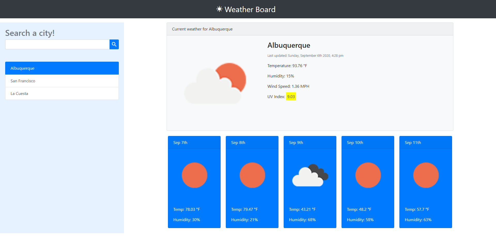

# Weather-Board  
A useful app to look up weather conditions in a city. Allows the user to look up a city and see its current weather conditions and a 5 day forcast. The searched city will also be added to "previously searched" list for easy re-viewing.  
  
## How To Use  
1. Search a city on the left.  
2. In the center the current weather conditions will be displayed.  
3. Conditions include:  
..* Icon of currrent conditions  
..* emperature  
..* Humidity  
..* Wind Speed  
..* UV Index  
  
  -Green: favorable  
  -Yellow: moderate  
  -Orange: severe  
  -Red: dangerous  
4. A 5 day forecast will display under curent conditions.  
5. Search more cities to add them to your history or click any city in the history column to see it weather conditions.

## Repo and Active Site  
[GitHub](https://github.com/TPino92/Weather-Board)  
[Live-Website](https://tpino92.github.io/Weather-Board/)  

## Screenshot (in use)  

